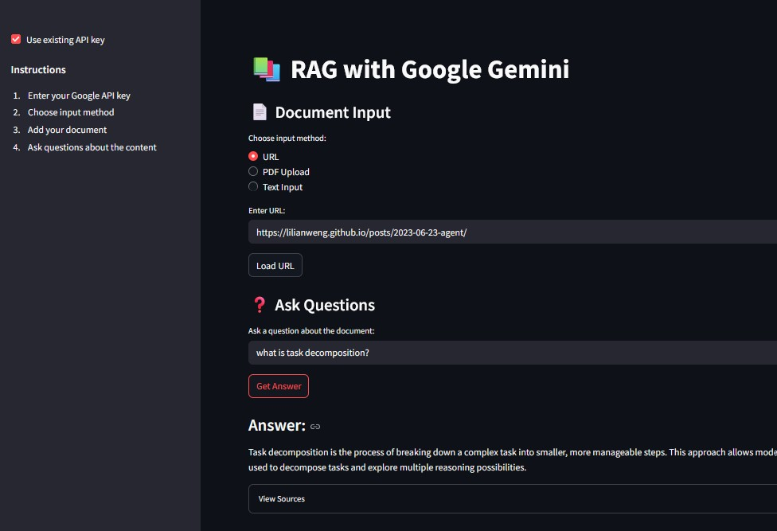

# RAG with Google Gemini

This is a Streamlit application that implements Retrieval-Augmented Generation (RAG) using Google's Gemini model. The application allows users to input documents through various methods (URL, PDF, or direct text) and ask questions about the content.

<div align="center">
  
</div>

## Prerequisites

1. Python 3.8 or higher
2. Google API Key for Gemini (obtain from [Google AI Studio](https://makersuite.google.com/app/apikey))
3. Required Python packages (listed in requirements.txt):
   - streamlit
   - langchain
   - langchain-community
   - langchain-core
   - langchain-google-genai
   - langchain-chroma
   - chromadb
   - beautifulsoup4
   - pypdf
   - typing-extensions

## Setup

1. **Install Dependencies**
   ```bash
   pip install -r requirements.txt
   ```

2. **Google API Key**
   - Get your API key from [Google AI Studio](https://makersuite.google.com/app/apikey)
   - You can either:
     - Set it as an environment variable: `export GOOGLE_API_KEY=your_api_key`
     - Enter it in the application's sidebar when running

## Running the Application

1. Navigate to the application directory:
   ```bash
   cd learn_gen_ai/hands_on/streamlit/rag_with_gemini
   ```

2. Start the Streamlit application:
   ```bash
   streamlit run app.py
   ```

3. Open your web browser and go to `http://localhost:8501` (or the URL shown in your terminal)

## Usage

1. **API Key Setup**
   - If you haven't set the API key as an environment variable, enter it in the sidebar
   - If you have set it, you can use the existing key

2. **Document Input**
   Choose one of three methods to input your document:
   - **URL**: Enter a web page URL to scrape content
   - **PDF Upload**: Upload a PDF file
   - **Text Input**: Directly paste or type text

3. **Ask Questions**
   - After your document is processed and indexed, use the question input field
   - Click "Get Answer" to generate a response
   - View source documents by expanding the "View Sources" section

## Features

- Multiple document input methods (URL, PDF, Text)
- Document chunking for better processing
- Vector store persistence for document embeddings
- Source attribution for generated answers
- User-friendly interface with progress indicators

## Notes

- The application uses Chroma as a vector store with local persistence
- Documents are split into chunks of 1000 characters with 200 character overlap
- The vector store is saved in `./chroma_langchain_db` directory
- For URLs, the application attempts to extract main content using BeautifulSoup
