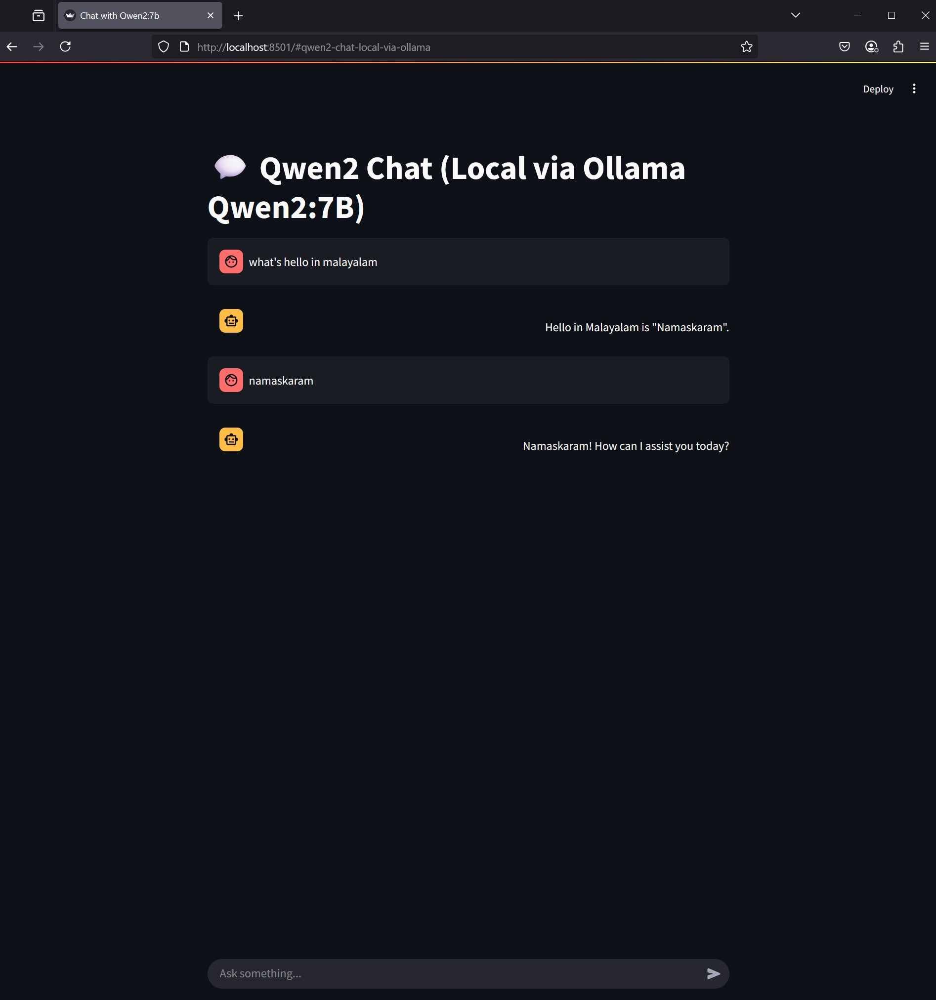

# Ollama Chat Interface with Streamlit

A simple chat interface built with Streamlit for interacting with locally hosted Ollama models, specifically designed for Qwen2:7b.



## Prerequisites

1. **Ollama**
   - Install Ollama from [Ollama's official website](https://ollama.ai/)
   - Make sure Ollama is running locally (default port: 11434)
   - Pull the Qwen2:7b model using:
     ```bash
     ollama pull qwen2:7b
     ```

2. **Python Requirements**
   - Python 3.8 or higher
   - Required packages:
     ```bash
     pip install streamlit requests
     ```

## Setup and Running

1. Make sure Ollama is running in the background
2. Run the Streamlit app:
   ```bash
   streamlit run app.py
   ```
3. Open your browser and navigate to the URL shown in the terminal (typically http://localhost:8501)

## Features

- Clean and simple chat interface
- Real-time responses from the Qwen2:7b model
- Right-aligned bot responses for better readability
- Persistent chat history during the session

## Configuration

The app uses the following default settings (which can be modified in `app.py`):
- Ollama URL: `http://localhost:11434/api/generate`
- Model: `qwen2:7b`

## Troubleshooting

If you encounter any issues:
1. Ensure Ollama is running (`ollama run qwen2:7b` in terminal)
2. Check if the model is properly downloaded
3. Verify the Ollama API endpoint is accessible
4. Make sure all required Python packages are installed
